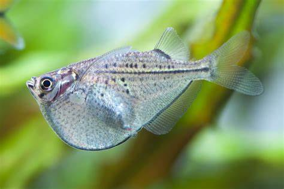
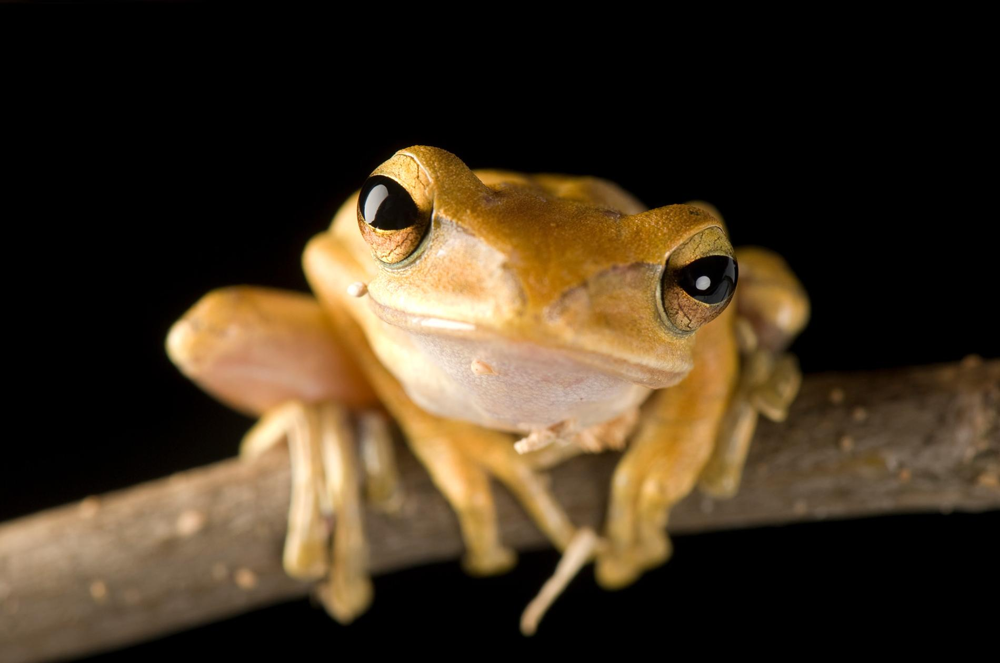
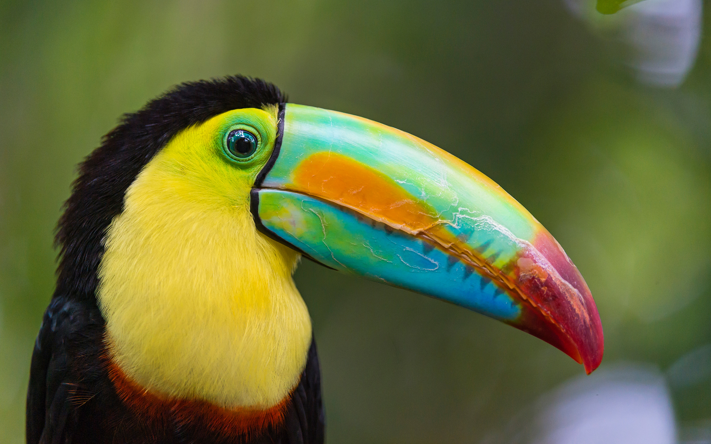
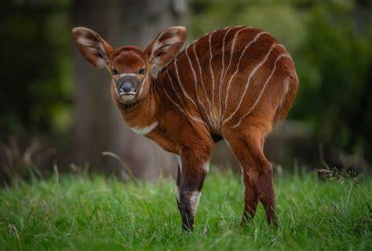
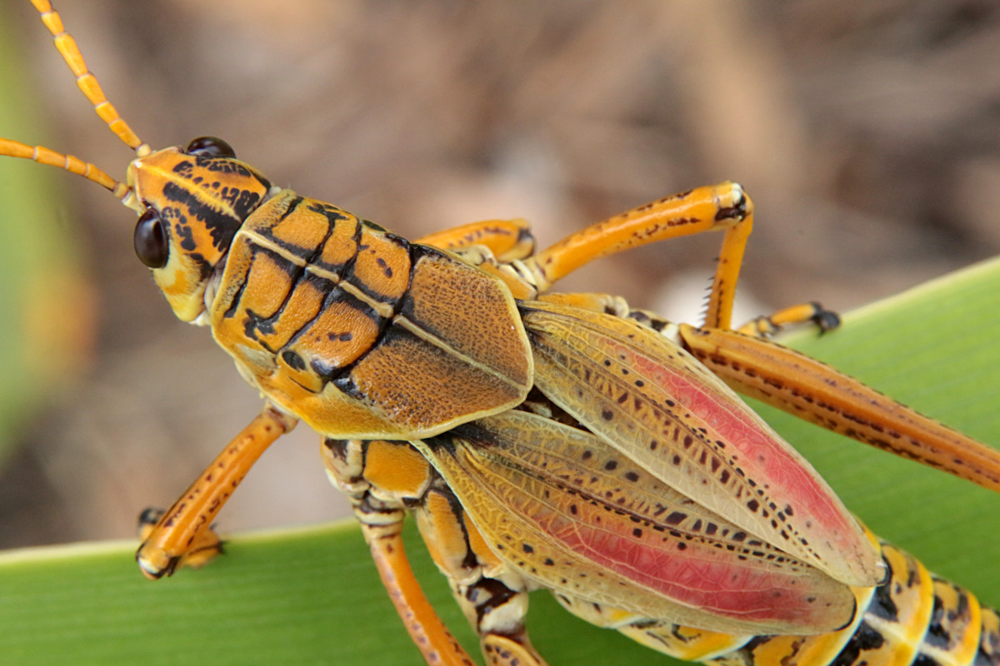
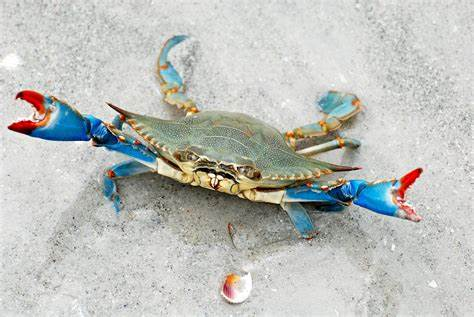
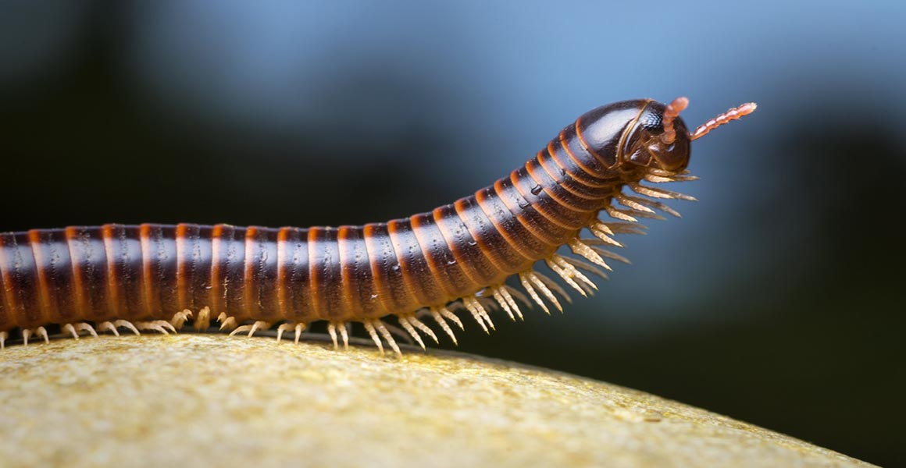
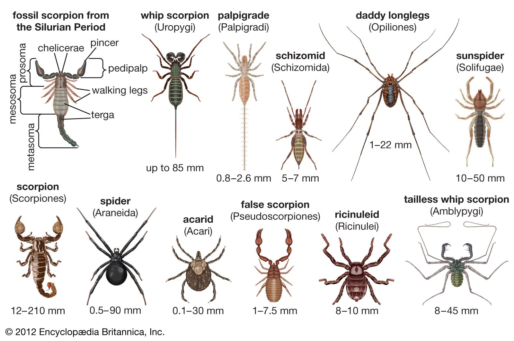
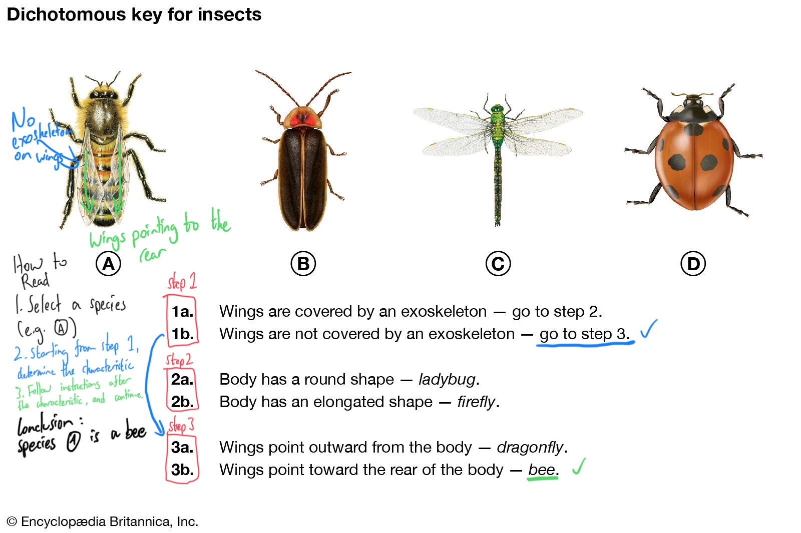
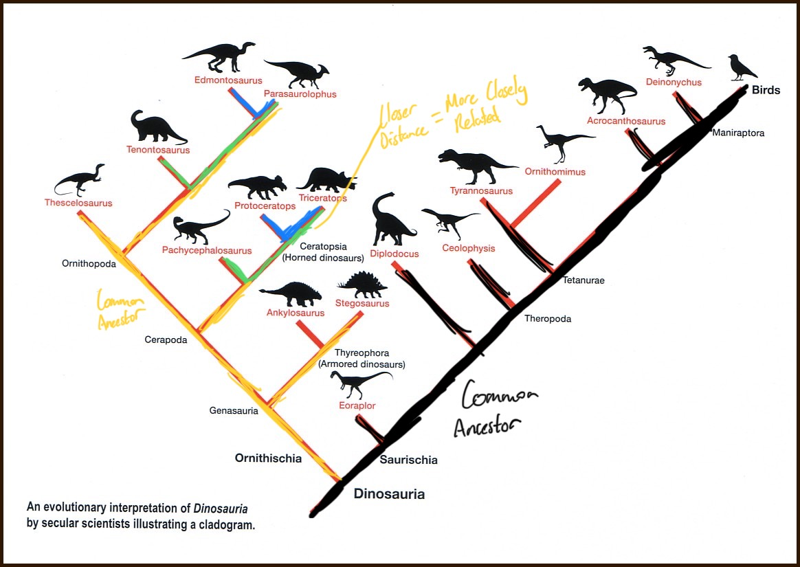

# Y9 IG Biology Study Guide

## Unit 1 - Characteristics & Classification of Living Organisms

### Mrs. Gren (Memorization is required)

**Most organisms has most or all of the characteristics mentioned below, but not all of them have all the characteristics at the same time**
  
|Letter|Characteristic|Definition|
|------|--------------|----------|
|M|Movement|The ability to cause a change in position using the organism or part of the organism|
|R|Respiration|To break down nutrient molecules and make energy through metabolism|
|S|Sensitivity|Ability to respond to changes in the environment|
|G|Growth|To increase in mass permanantly|
|R|Reproduction|To produce more of the same organism|
|E|Excretion|To remove waste products from metabolism or excess material|
|N|Nutrition|To have an intake of material for energy, growth, etc|

### Taxonomy and Classification Systems
**Definition: A way to identify an organism and place it into the correct group with related organisms according to shared physical characteristics.**

Carl Linnaeus: Father of taxonomy

#### Features of organisms
**Appearance**
- Number of legs
- Hair
- Scales
- Wings
- Beak
- ...
- **Not Colour!!**

**Anatomy**
- Body structure
- Organ structure

**Where it eats**
- Photosynthetic
- Carnivore
- Herbivore
- Decomposer

**Where it lives**
- Continental
- Island
- Under water
- Inside other organisms

**How it reproduces**
- Sexually
- Asexually

#### Taxons (Memorization is required):
1. Domain
2. Kingdom
3. Phylum
4. Class
5. Order
6. Family
7. Genus
8. Species

##### Kindoms
||Animals|Plants|Fungi|Protists|Eubacteria|Archae|
|-|------|------|-----|--------|----------|------|
|Nucleus|yes|yes|yes|yes|no|no|
|Cell Wall|no|yes|yes|yes|yes|yes|
|Hyphae|no|no|yes|no|no|no|
|Chloroplasts|no|yes|no|yes|no|no|
|Produce Spores|no|yes|yes|yes|yes|no|
|Simple or Complex|complex|complex|complex|complex|complex|simple|

##### Vertebrates
**Animals with a spine**

*(In the order of revolution):*

**Fish**

- Scaly, slippery skin
- Uses gills to breath
- Lays shell-less eggs
- Movement with fins
- Cold blooded

**Amphibians**

- Slippery skin without scales
- Young uses gills to breath
- Adult uses lungs and skin to breath
- Young lives in water
- Adult lives on land
- Cold blooded

**Reptiles**

- Dry, scaly skin
- Lays hard eggs (not as hard as birds)
- Cold blooded
- Uses lungs to breath
- Mostly lives on land

**Birds**

- Warm blooded
- Lays hard shelled eggs
- Has feathers and beaks
- Has wings so (mostly) can fly
- Uses lungs to breath

**Mammals**

- Warm blooded
- (mostly) Do not lay eggs
- (mostly) Has fur or hair
- Most live on land and some live in water
- Uses lungs to breath

##### Arthropods
**Invertebrate animal with an exoskeleton, segmented body, and joint legs**

**Insects**

- 3 segments in the body 
- wings
- antennae
- 3 pairs of legs

**Crustaceans**

- 5-7 pairs of legs
- no wings
- antennae

**Myriapods**

- Many segments and many pairs of legs
- Long body
- Definitly no wings (it would be horrifying if they did)

**Arachnids**

- 2 segments in the body
- 4 pairs of legs
- no wings
- no antennae

#### Binomial naming system
**A system of naming species developed by Carl Linnaeus in the mid 1700s**

First part = genus

Second part = species

Example: *Homo sapiens* - Binomial name of modern humans

#### Dichotomous Keys
**A table that classifies species with characteristics, each characteristic branching into two new ones to differentiate species**

Example of a Dichotomous Key and how to read it from Encyclopedia Brittanica

#### Cladograms
**Similar to Dichotomous Keys, a diagram that differentiate species from a common ancestor**

Example of a Cladogram of dinosaur species

### Key Definitions
**Cladogram** - a branching diagram showing the relationship between a number of species according to their characteristics
**Dichotomous Key** - A table that classifies species with characteristics, each characteristic branching into two new ones to differentiate species
**Metabolism** - All chemical reactions that happens within cells
**Photosythesis** - A reaction occuring in the chloroplasts of cells, turning carbon dioxide, water, and sunlight into oxygen, glucose, and energy. 

**Species** - A group of organism which are able to produce fertile offspring
**Taxonomy** - 

## Unit 2

## Unit 3

## Unit 4

## Unit 5

## Unit 6

## Unit 7

## Unit 8

## Unit 9

## Unit 10

## Unit 11

## Unit 12

## Unit 13